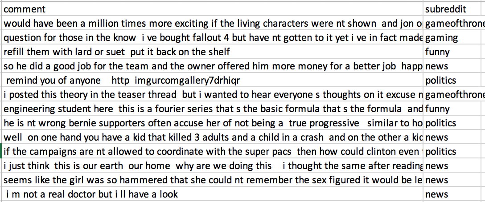
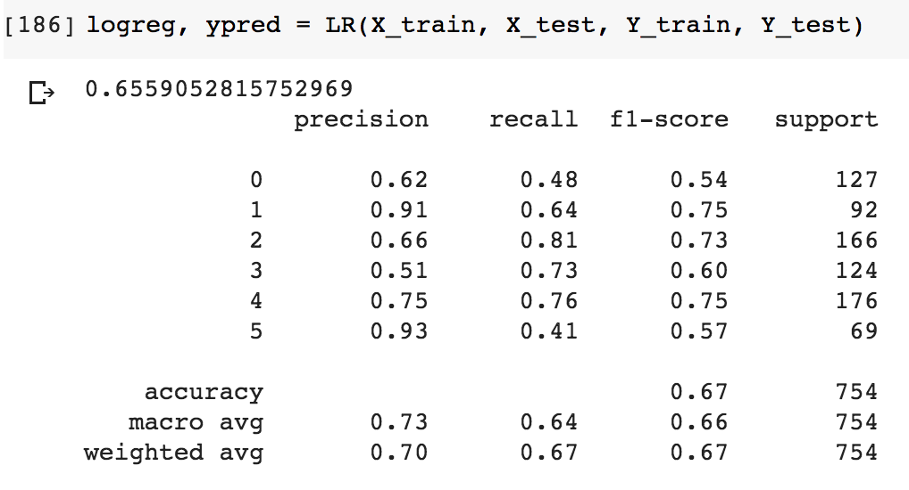

# NLP-PolyAI-reddit-challenge
Challenge organized by PolyIA. From Reddit's comments, predict the category of comments (subreddits). 

Kaggle challenge: https://www.kaggle.com/c/semaine-ia-reddit-challenge 

Objective: This AI week challenge challenged our artificial intelligence skills, more specifically natural language processing. The goal was to succeed in predicting, from the text of a comment on a forum, from which category it comes from.

To do this, we had a bank of comments from the Reddit website communities. On Reddit, the different communities are concentrated in "subreddits". It is this information, the subreddit where the comment was posted, that our model had to learn to predict.

Data:

Realization: I implemented a logistic regression model that obtained an f1-score of 67% on my test set and 64% on the test set provided for the challenge. I used TF-IDF representation for words and cleaned the dataset using scipy (tokenization, lematization, lower case and ponctuation). 

I tried to oversample my dataset with EDA method https://github.com/jasonwei20/eda_nlp but although it improved the f1_score with CV and my data (almost 90%), it did not generalize well on the unknown data provided for the challenge (63%).

Personal note: A very nice little challenge that introduced me to NLP. If I had more time, I would have liked to explore another representation of the data with the word2vec algorithm for example. I spoke with the person who won the competition and I will definitely check out the Google pre-trained models for NLP!
